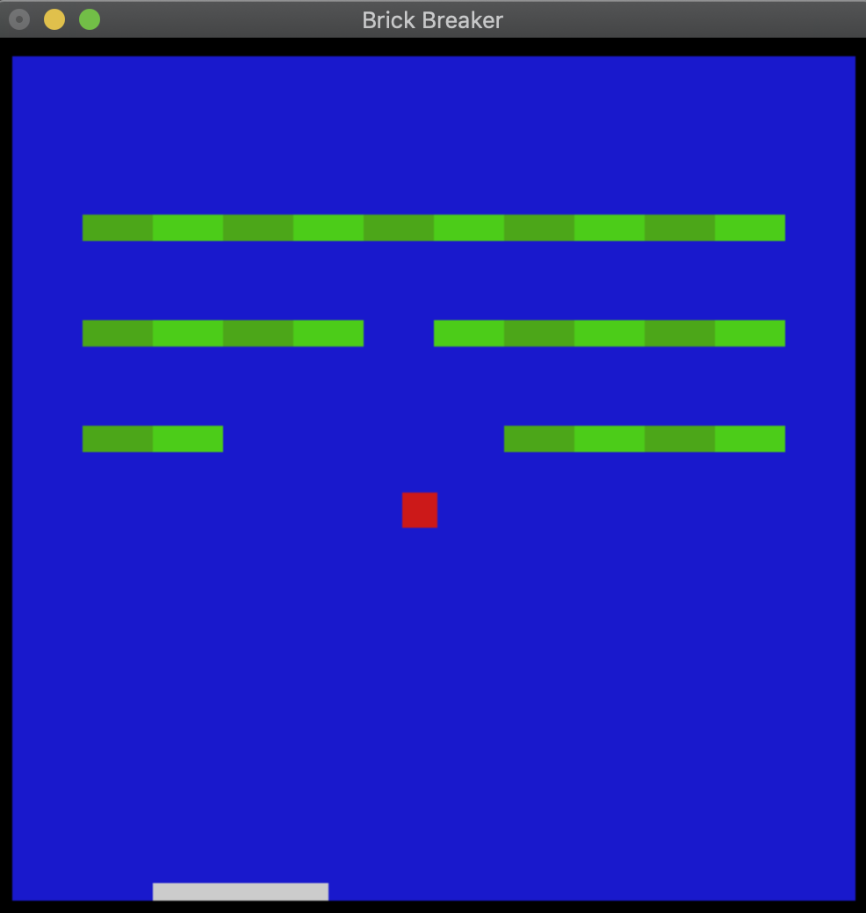

# BrickBreakerOpenGL
A re-creation of the game Brick Breaker made in OpenGl

Simple recreation using OpenGL graphics, coded entirely in c++ 

The game currently plays by left clicking on the red square and dragging the cursor towards where you want it to go then releasing.   
The further the cursor is dragged before release the quicked the ball will move so its possible to propel it to absurd speeds.   
Paddle is moved by using the 'a' key to move it left and the 'd' key to move it right.   
Paddle movements won't work for 'A' and 'D' currently.   

Planned changes found in the file:   
//#9   ADD LEVELS (WHEN FINAL BRICK DESTROYED CREATE NEW PATTERN AND RESET BALL)   
//#10  ADD SCORE   
//#11  ADD VARIOUS BRICK TYPES   
//#12  ADD VARIOUS POWER UPS   
//#13  ADD END OF LEVEL ANIMATION   
//#14  ADD TEXT TO SCREEN   
//#15  ADD MENU OR KEY SELECTION TO CHANGE BACKGROUNDS, BALL COLOR, ETC.   
//#16  NORMALIZE LAUNCH VALUES SO A CONSISTENT SPEED IS ACHIEVED WITH EACH LAUNCH ONLY DIRECTION IS RECORDED   
//#17 ADD BALL COUNT   

Executable included named Brick

Hasn't been tested for Windows so I can't confirm it works on there.   
Ran on macOS Mojave version 10.14.6
